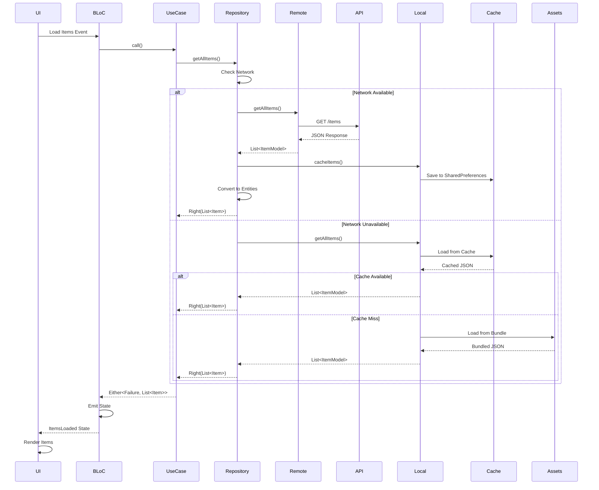
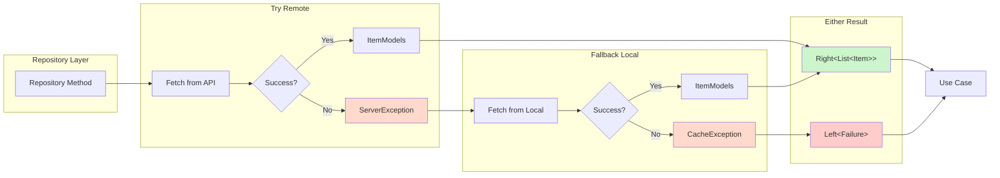
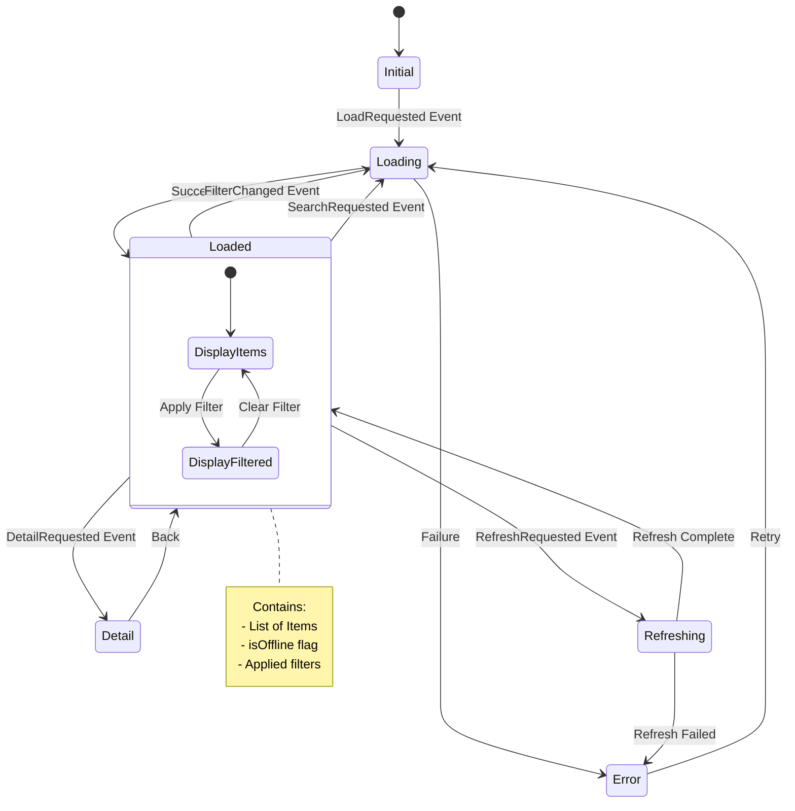
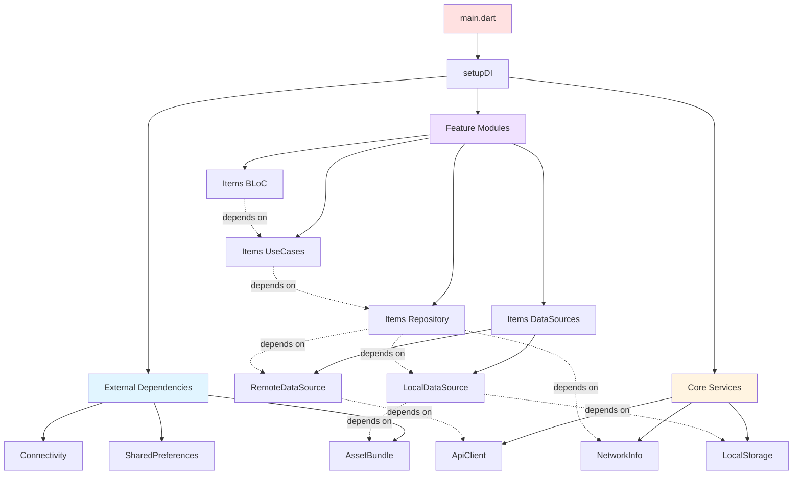
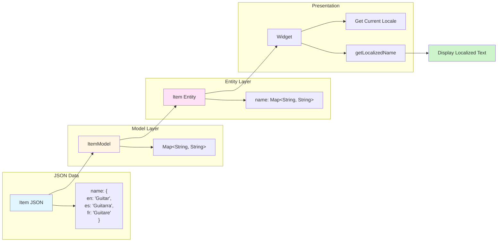
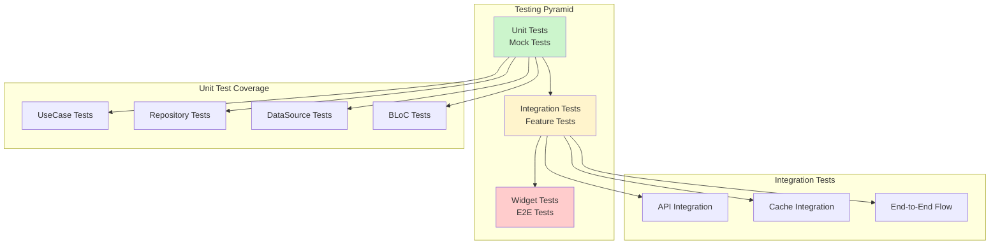
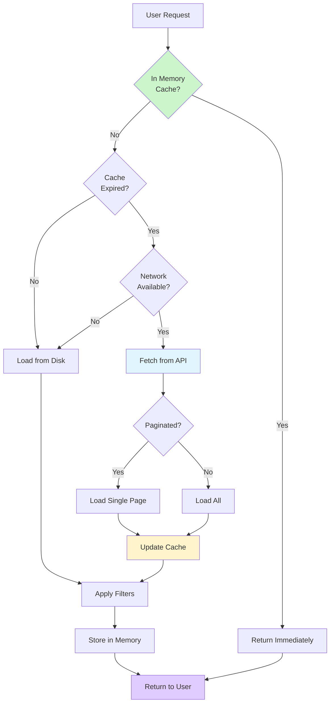

# Arc Raiders Library - Architecture Diagrams

## 1. Clean Architecture Layers

```mermaid
graph TB
    subgraph "Presentation Layer"
        UI[UI Widgets]
        BLOC[BLoC/Cubit]
    end

    subgraph "Domain Layer"
        UC[Use Cases]
        REPO_INT[Repository Interface]
        ENT[Entities]
    end

    subgraph "Data Layer"
        REPO_IMPL[Repository Implementation]
        REMOTE[Remote Data Source]
        LOCAL[Local Data Source]
        MODEL[Models & DTOs]
    end

    subgraph "External"
        API[MetaForge API]
        ASSETS[JSON Assets]
        CACHE[SharedPreferences]
    end

    UI --> BLOC
    BLOC --> UC
    UC --> REPO_INT
    REPO_INT -.implements.- REPO_IMPL
    REPO_IMPL --> REMOTE
    REPO_IMPL --> LOCAL
    REMOTE --> API
    LOCAL --> ASSETS
    LOCAL --> CACHE
    MODEL --> ENT

    style "Presentation Layer" fill:#e1f5ff
    style "Domain Layer" fill:#fff4e1
    style "Data Layer" fill:#f0f0f0
    style "External" fill:#ffe1e1
```

## 2. Data Flow - Online Mode



## 3. Offline-First Strategy Flow

```mermaid
flowchart TD
    Start([User Requests Items]) --> CheckNetwork{Network<br/>Available?}

    CheckNetwork -->|Yes| FetchRemote[Fetch from API]
    CheckNetwork -->|No| UseLocal[Use Local Data]

    FetchRemote --> RemoteSuccess{Success?}
    RemoteSuccess -->|Yes| SaveCache[Save to Cache]
    RemoteSuccess -->|No| UseLocal

    SaveCache --> ConvertEntity[Convert to Entities]

    UseLocal --> CheckCache{Cache<br/>Available?}
    CheckCache -->|Yes| LoadCache[Load from Cache]
    CheckCache -->|No| LoadAssets[Load from Assets]

    LoadCache --> ConvertEntity
    LoadAssets --> ConvertEntity

    ConvertEntity --> ApplyFilters[Apply Filters]
    ApplyFilters --> ReturnData[Return Right(Items)]

    ReturnData --> End([Display to User])

    style CheckNetwork fill:#fff4cc
    style RemoteSuccess fill:#fff4cc
    style CheckCache fill:#fff4cc
    style SaveCache fill:#ccf5cc
    style LoadCache fill:#ccf5cc
    style LoadAssets fill:#ccf5cc
    style ConvertEntity fill:#cce5ff
    style ReturnData fill:#e1ccff
```

## 4. Feature Module Structure

```mermaid
graph LR
    subgraph "Items Feature"
        direction TB
        I_PRES[Presentation]
        I_DOMAIN[Domain]
        I_DATA[Data]

        I_PRES --> I_DOMAIN
        I_DOMAIN --> I_DATA
    end

    subgraph "Quests Feature"
        direction TB
        Q_PRES[Presentation]
        Q_DOMAIN[Domain]
        Q_DATA[Data]

        Q_PRES --> Q_DOMAIN
        Q_DOMAIN --> Q_DATA
    end

    subgraph "Weapons Feature"
        direction TB
        W_PRES[Presentation]
        W_DOMAIN[Domain]
        W_DATA[Data]

        W_PRES --> W_DOMAIN
        W_DOMAIN --> W_DATA
    end

    subgraph "Core"
        NETWORK[Network]
        ERROR[Error Handling]
        DI[Dependency Injection]
    end

    I_DATA --> Core
    Q_DATA --> Core
    W_DATA --> Core

    style "Items Feature" fill:#e1f5ff
    style "Quests Feature" fill:#ffe1f5
    style "Weapons Feature" fill:#f5ffe1
    style "Core" fill:#fff4e1
```

## 5. Error Handling with fpdart



## 6. BLoC State Management



## 7. Dependency Injection Flow



## 8. Multi-Language Support



## 9. Testing Strategy



## 10. Performance Optimization Flow



## Key Benefits

### 1. Separation of Concerns
- Each layer has a single responsibility
- Easy to modify, extend, and test
- Clear boundaries between layers

### 2. Testability
- Mock dependencies at boundaries
- Test each layer independently
- High test coverage achievable

### 3. Flexibility
- Easy to swap implementations
- Add new data sources without affecting business logic
- Change UI framework without touching domain

### 4. Offline-First
- Works without internet
- Graceful degradation
- Automatic synchronization

### 5. Type Safety
- fpdart Either for error handling
- No runtime surprises
- Compile-time guarantees

### 6. Scalability
- Modular feature structure
- Easy to add new features
- Team can work in parallel

### 7. Maintainability
- SOLID principles
- Clean code practices
- Self-documenting architecture
